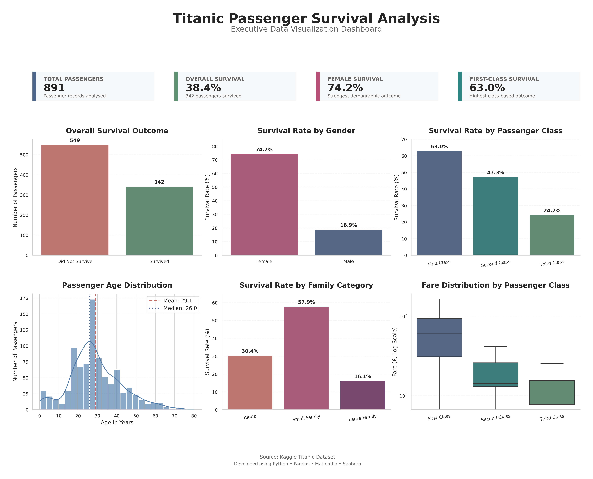
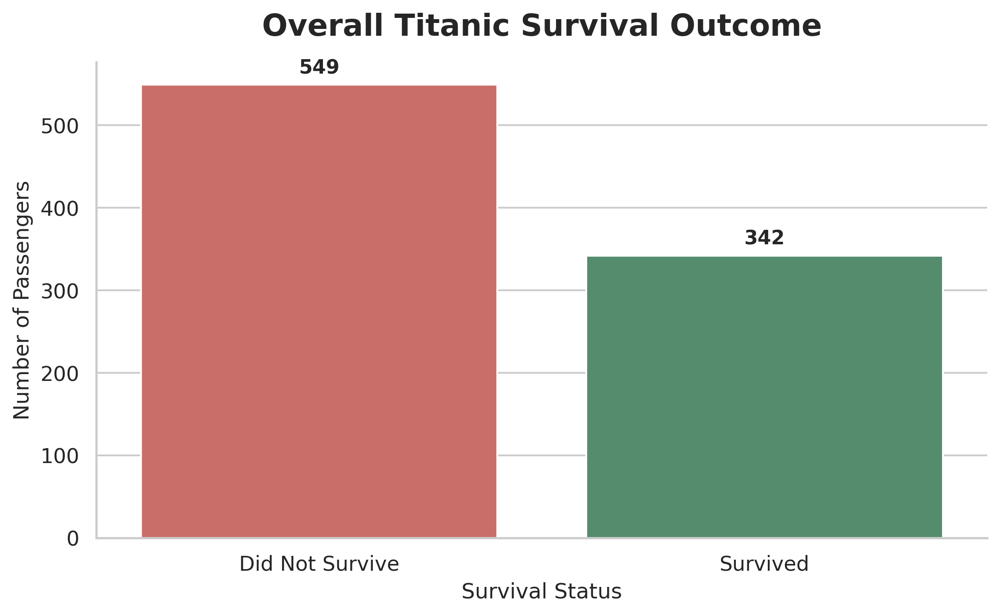
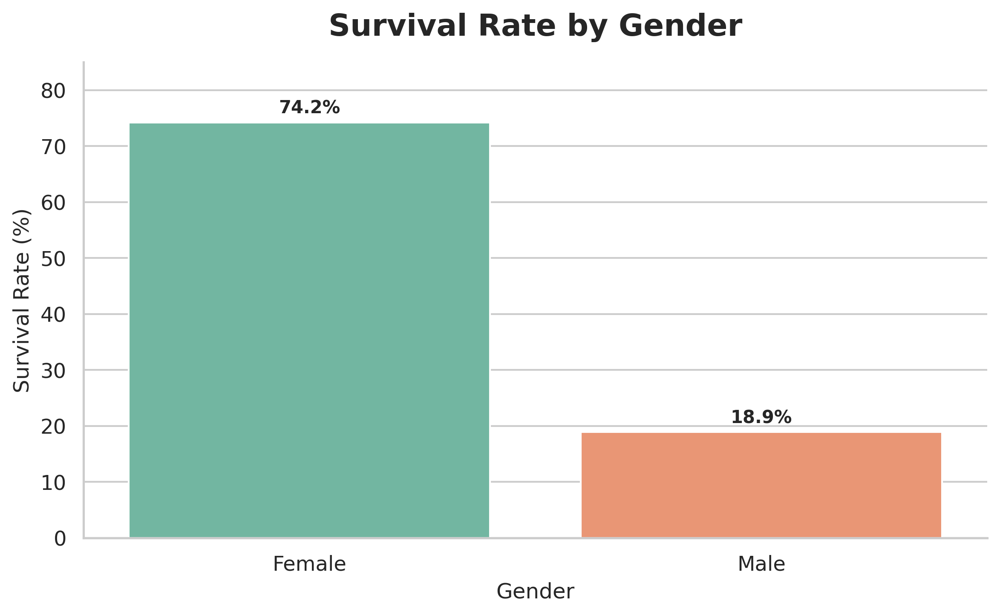
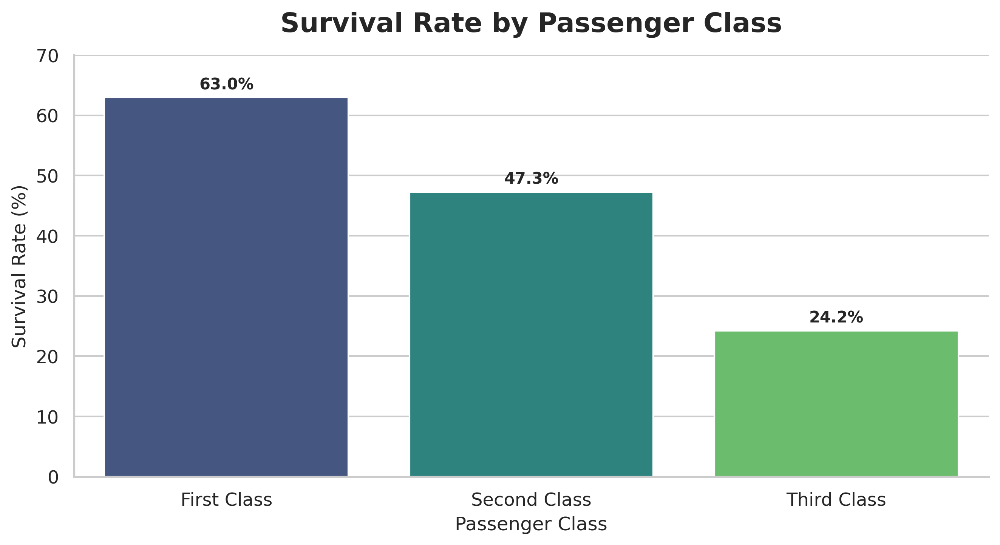
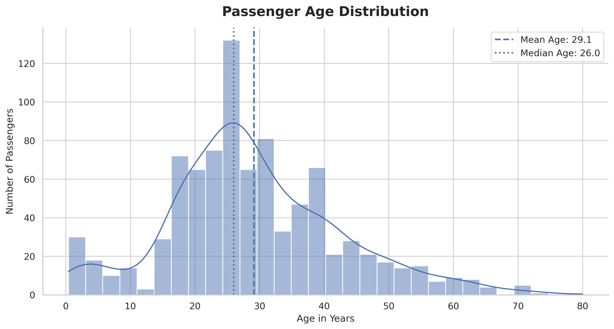
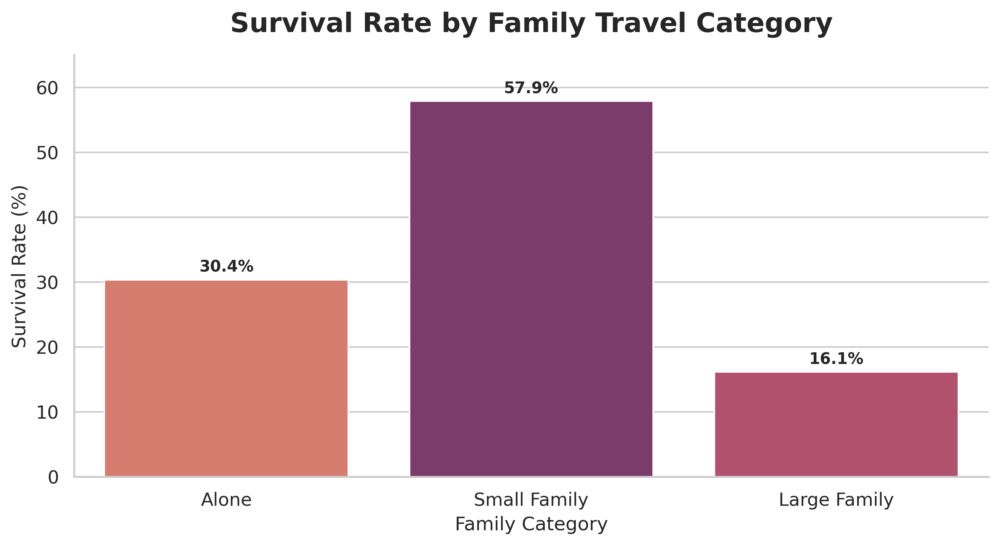
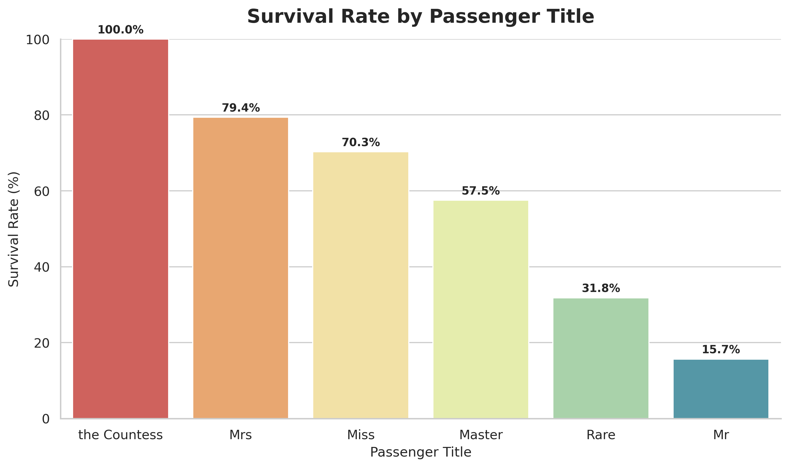
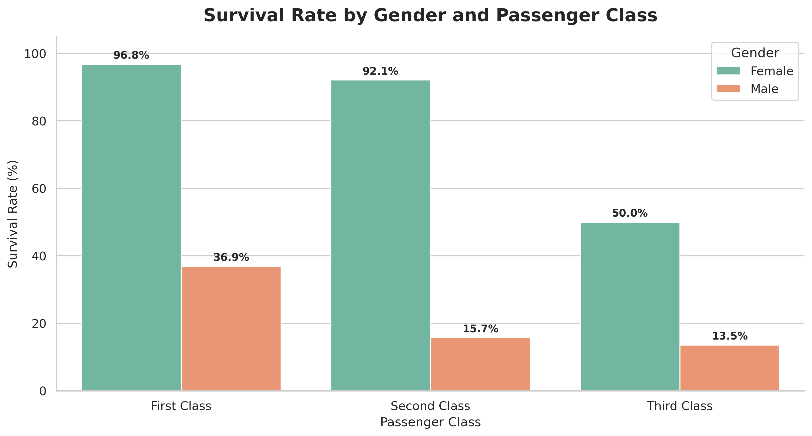
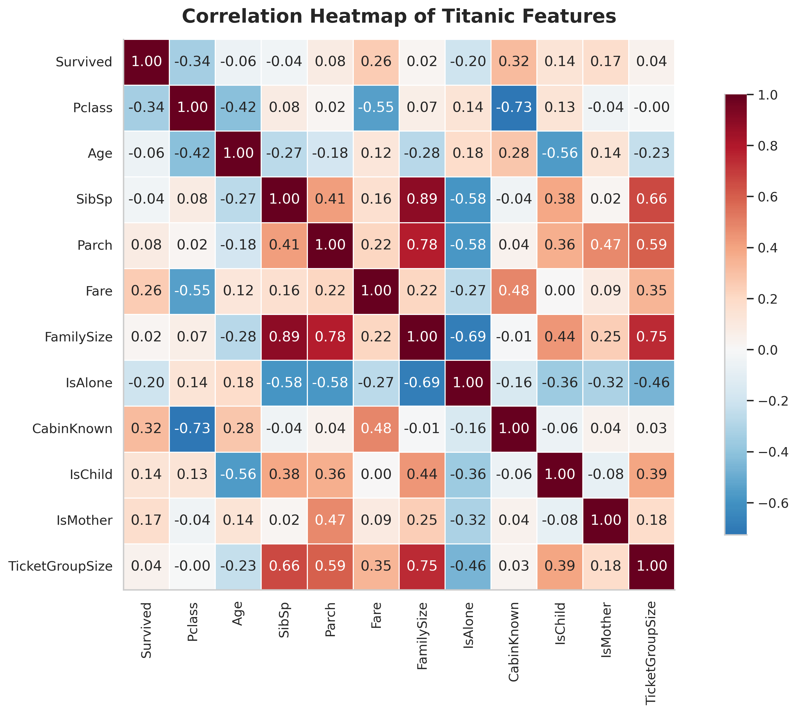

# 🚢 Titanic Data Visualization Dashboard


A professional exploratory data analysis and visualization project based on the famous **Titanic passenger dataset**.

This project demonstrates **data cleaning**, **feature engineering**, **exploratory data analysis (EDA)**, **statistical visualization**, and the development of a **premium executive dashboard** using Python.

---

# 📊 Executive Dashboard



---

# 🎯 Project Objective

The objective of this project is to transform the Titanic passenger dataset into a meaningful visual story.

This analysis explores how passenger characteristics such as:

- Gender
- Passenger Class
- Age
- Fare
- Family Structure
- Cabin Availability
- Embarkation Port
- Passenger Title

influenced survival.

The project focuses on transforming raw data into business-quality insights through professional visualization.

---

# ✨ Project Highlights

- ✅ Cleaned and validated raw Titanic dataset
- ✅ Handled missing values intelligently
- ✅ Engineered 13 new meaningful features
- ✅ Built 12 publication-quality visualizations
- ✅ Created a premium executive dashboard
- ✅ Performed statistical exploration
- ✅ Exported cleaned feature-engineered dataset
- ✅ Professional GitHub documentation

---

# 🧹 Data Cleaning

The following preprocessing steps were performed:

- Removed duplicate records
- Checked missing values
- Filled missing Age values using median age grouped by passenger Title and Class
- Filled missing Embarked values using Mode
- Extracted useful Cabin information
- Converted Cabin into CabinKnown and Deck features
- Removed unnecessary columns after feature extraction
- Validated categorical values

---

# 🧠 Feature Engineering

The following engineered features were created:

| Feature | Description |
|----------|-------------|
| Title | Passenger title extracted from Name |
| FamilySize | SibSp + Parch + 1 |
| IsAlone | Indicates passengers travelling alone |
| TravelStatus | Alone or With Family |
| FamilyCategory | Alone / Small Family / Large Family |
| AgeGroup | Passenger age category |
| FareGroup | Fare quartile category |
| CabinKnown | Cabin information available or not |
| Deck | Deck extracted from Cabin |
| IsChild | Child indicator |
| IsMother | Mother indicator |
| TicketGroupSize | Number of passengers sharing the same ticket |
| Surname | Family surname extracted from Name |

---

# 📈 Executive Dashboard

The dashboard summarizes the most important business insights.

KPIs included:

- Total Passengers
- Overall Survival Rate
- Female Survival Rate
- First Class Survival Rate

Visualizations included:

- Overall Survival
- Survival by Gender
- Survival by Passenger Class
- Passenger Age Distribution
- Family Survival
- Fare Distribution
- Correlation Heatmap

---

# 📷 Selected Visualizations

## Overall Survival



---

## Survival by Gender



---

## Survival by Passenger Class



---

## Age Distribution



---

## Family Survival



---

## Survival by Passenger Title



---

## Gender vs Passenger Class



---

## Correlation Heatmap



---

# 📊 Key Findings

### 1. Overall Survival

- Overall survival rate was **38.4%**.

---

### 2. Gender

Female passengers survived at a much higher rate than males.

- Female Survival: **74.2%**
- Male Survival: **18.9%**

---

### 3. Passenger Class

First-class passengers experienced the highest survival.

| Class | Survival Rate |
|--------|--------------|
| First | 63.0% |
| Second | 47.3% |
| Third | 24.2% |

---

### 4. Family Size

Passengers travelling with **small families** had the highest survival probability.

---

### 5. Fare

Higher ticket fares generally corresponded to higher survival rates.

---

### 6. Passenger Titles

Titles such as **Mrs**, **Miss**, and **Master** showed considerably higher survival than **Mr**.

---

### 7. Age

Children showed relatively better survival than adults.

---

### 8. Cabin Information

Passengers with recorded cabin information generally had higher survival.

---

# 🛠 Technologies Used

- Python
- Pandas
- NumPy
- Matplotlib
- Seaborn
- Google Colab
- GitHub

---

# 📂 Repository Structure

```text
Titanic-Data-Visualization-Dashboard
│
├── Titanic_Data_Visualization_Dashboard.ipynb
├── titanic_cleaned_and_featured.csv
├── requirements.txt
├── README.md
├── LICENSE
├── .gitignore
│
├── titanic_premium_executive_dashboard.png
├── overall_survival.png
├── age_distribution.png
├── age_vs_fare.png
├── survival_by_gender.png
├── survival_by_class.png
├── survival_by_family.png
├── survival_by_age_group.png
├── survival_by_port.png
├── survival_by_title.png
├── survival_gender_class.png
├── correlation_heatmap.png
```

---

# ▶️ How to Run

## Clone Repository

```bash
git clone https://github.com/Vineesha04/Titanic-Data-Visualization-Dashboard.git
```

Go inside

```bash
cd Titanic-Data-Visualization-Dashboard
```

Install dependencies

```bash
pip install -r requirements.txt
```

Launch Jupyter Notebook

```bash
jupyter notebook
```

Open

```text
Titanic_Data_Visualization_Dashboard.ipynb
```

Run all cells.

---

# ⚠️ Limitations

- Dataset contains missing Cabin values.
- Age values required estimation.
- Analysis identifies relationships rather than causal effects.
- Some real-world factors (lifeboat access, evacuation timing) are unavailable.
- Findings are based on the Kaggle Titanic dataset.

---

# 🚀 Future Improvements

- Build an interactive Streamlit dashboard
- Deploy dashboard online
- Perform statistical hypothesis testing
- Develop machine learning survival prediction models
- Compare Logistic Regression, Random Forest, XGBoost
- Add SHAP model explainability
- Build a responsive web application

---

# 📜 License

This project is licensed under the **MIT License**.

---

# 👩‍💻 Author

**Vineesha Reddy**

B.Tech Computer Science Engineering (Networks)

GitHub: **https://github.com/Vineesha04**

---

⭐ If you found this project useful, consider giving the repository a star.
